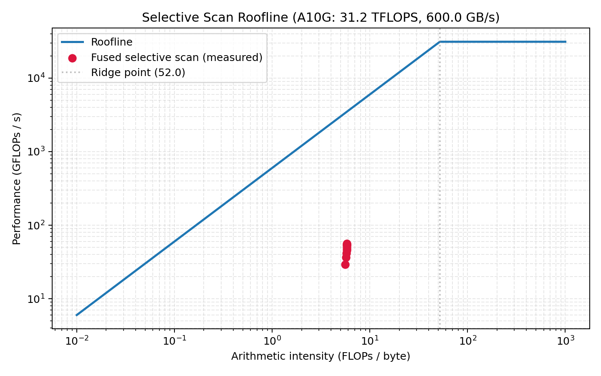
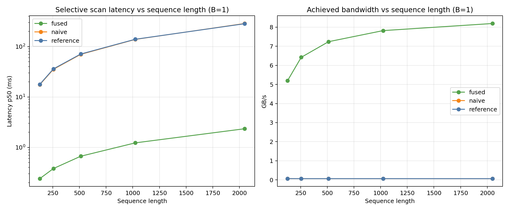
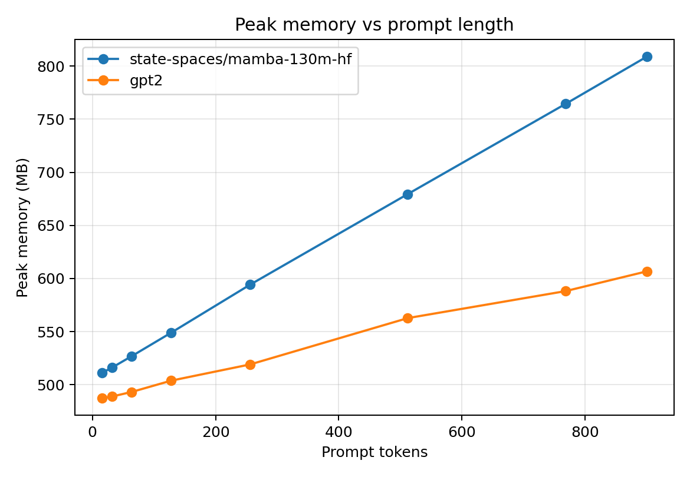

# Mamba From Scratch

A from-scratch implementation of the core ideas behind **Mamba**: continuous-time state space models, selective scan, parallel scan, a fused Triton kernel, Mamba-2 SSD, parity checks against the official HuggingFace model, and GPU benchmark / profiling analysis.

> **Educational reimplementation.** For production use, prefer [`state-spaces/mamba`](https://github.com/state-spaces/mamba). This repo's goal is clarity, correctness, and honest comparison against that reference — not replacing it.

This repo is both:
- a **learning artifact** you can read end-to-end, and
- an **engineering artifact** you can run, test, benchmark, and extend.

---

## What this proves

- Rebuilt selective scan from scratch in PyTorch, bit-exact vs `mamba_ssm.selective_scan_ref` at fp32, within tolerance vs the CUDA-fused kernel at fp16.
- Loaded pretrained `state-spaces/mamba-130m-hf` weights into the from-scratch block and drove full-model generation through the naive scan, **token-exact** vs the unpatched HuggingFace baseline.
- Built a fused Triton decode kernel. **2.3–2.7× vs a pure-PyTorch equivalent** for the isolated SSM step (honest MBU: 1.5% at B=1 → 12% at B=8 of the A10G's 600 GB/s peak — launch-latency bound at Mamba-130m shapes).
- Implemented Mamba-2 via chunked SSD; prefill is O(L) and stays flat through pl=1024 on A10G.
- Cross-engine benchmark suite (minimamba-mamba1/2, `mamba_ssm`-mamba1/2, Pythia-160m/2.8b) with CSV + plots. At pl=4096, minimamba-mamba2 beats Pythia-2.8b prefill **2.8×** on pure einsum — the point of Mamba.
- Honest gap vs `mamba_ssm`: our prefill is 2–5× slower (un-fused conv + dt_bias + softplus + chunk scan); our decode is within 10–20%.

---

## Key results (NVIDIA A10G)

### Fused Triton kernel performance (B=1, D=768, N=16)

| Seq Length | Reference (ms) | Fused Triton (ms) | Speedup | Bandwidth (GB/s) |
|------------|---------------:|-------------------:|--------:|------------------:|
| 128        | 17.79          | 0.240              | 74x     | 5.2               |
| 256        | 36.04          | 0.381              | 95x     | 6.4               |
| 512        | 71.06          | 0.668              | 106x    | 7.2               |
| 1024       | 139.57         | 1.231              | 113x    | 7.8               |
| 2048       | 283.38         | 2.344              | 121x    | 8.2               |

### Reference parity (naive selective scan vs `mamba_ssm`)

Reference parity anchor: the from-scratch scan must match the authoritative reference.

| Check | Setting | Max abs diff |
|---|---|---:|
| `selective_scan_naive` vs `mamba_ssm.selective_scan_ref` | CPU, fp32, gate × skip × softplus sweep | **0.0** (bit-exact) |
| `selective_scan_naive` vs `mamba_ssm.selective_scan_fn` (fused CUDA) | A10G, fp32 | < 1e-5 |
| `selective_scan_naive` vs `mamba_ssm.selective_scan_fn` (fused CUDA) | A10G, fp16 | < 2e-3 |
| `MambaBlock` (our layer-0) vs HF `MambaMixer` | A10G, fp32, random input | **0.0** |
| HF full-model logits, scan swapped for `selective_scan_naive` | A10G, fp32, 24 layers patched | **0.0** |
| Greedy generation with patched scan vs unpatched HF | A10G, 20 new tokens | **token-exact** |

Reproduced by `tests/test_naive_vs_reference.py` and notebooks `01_selective_scan_derivation.ipynb` / `02_mamba130m_naive_generate.ipynb`.

### Official model parity (per-layer mixer)

| Layers tested | Max absolute error | Mean absolute error |
|---------------|-------------------:|--------------------:|
| 0, 5, 11, 17, 23 | **0.0**        | **0.0**             |

### Inference comparison (Mamba-130M vs GPT-2)

| Model | Prompt tokens | TTFT (ms) | Decode (tok/s) | Peak memory (MB) |
|-------|-------------:|----------:|---------------:|------------------:|
| Mamba | 24           | 311.6     | 75.8           | 988.5             |
| GPT-2 | 24           | 43.3      | 159.8          | 983.0             |
| Mamba | 384          | 702.5     | 52.1           | 1112.8            |
| GPT-2 | 384          | 10.2      | 137.6          | 1055.8            |
| Mamba | 768          | 1394.8    | 51.7           | 1240.5            |
| GPT-2 | 768          | 18.3      | 133.7          | 1082.1            |

> **Note:** HF Mamba uses a pure Python sequential loop (no optimized CUDA kernels), which explains its slower TTFT and throughput. The kernel-level benchmarks above show the real performance of the fused scan path.

### Roofline



All fused kernel measurements sit left of the ridge point, confirming selective scan is **memory-bound** on A10G.

### Scan benchmark



### Memory scaling



---

## What this repo does

This project walks through the Mamba stack in layers:

1. **SSM math** — ZOH discretization, continuous-to-discrete recurrence
2. **Reference implementation** — selective scan in PyTorch, minimal `MambaBlock`
3. **Algorithmic acceleration** — sequential, parallel (Hillis-Steele), and chunked affine scans
4. **Kernel path** — fused Triton selective scan with automatic fallback
5. **System validation** — official model parity, scan benchmarks, inference comparison, roofline analysis

---

## Repository layout

```text
mamba-from-scratch/
├── PROJECT_PLAN.md                 # Full implementation plan
├── CONTRACTS.md                    # Shape / dtype / tolerance contracts
├── ARCHITECTURE.md                 # Architecture source of truth
├── notebooks/
│   ├── 01_selective_scan_derivation.ipynb  # Tiny-tensor derivation + mamba_ssm parity
│   ├── 02_mamba130m_naive_generate.ipynb   # Mamba-130m generation via our naive scan
│   ├── 01_ssm_basics.ipynb                 # Classical SSMs in NumPy
│   ├── 02_selective_scan.ipynb             # Selective scan walkthrough
│   ├── 03_parallel_scan.ipynb              # Parallel scan algorithms
│   ├── 05_profiling.ipynb                  # Roofline and bandwidth analysis
│   └── 07_inference_comparison.ipynb       # Mamba vs GPT-2 on GPU
├── src/mamba_minimal/
│   ├── discretization.py           # ZOH discretization
│   ├── scan_naive.py               # Naive selective scan, oracle-matching (mamba_ssm)
│   ├── selective_scan.py           # Earlier reference selective scan (legacy API)
│   ├── weights.py                  # HF Mamba checkpoint loader + mixer extractor
│   ├── model.py                    # Readable MambaBlock
│   ├── parallel_scan.py            # Sequential, Hillis-Steele, chunked scans
│   ├── ssd.py                      # Mamba-2 SSD prototype
│   ├── generate.py                 # Text generation wrapper
│   ├── api.py                      # FastAPI serving layer
│   └── backend/                    # Capability checks + backend policy
├── kernels/
│   ├── scan_fused.py               # Fused Triton selective scan kernel
│   ├── scan_naive.py               # Reference-wrapper baseline
│   └── autotune.py                 # Kernel autotuning utilities
├── benchmarks/
│   ├── benchmark_scan.py           # Scan backend comparison
│   ├── benchmark_inference.py      # Mamba vs GPT-2 inference
│   ├── roofline.py                 # Roofline chart generation
│   ├── parallel_scan.py            # Our MambaModel vs HF Mamba tok/s
│   ├── decode_kernel.py            # Triton decode kernel microbench
│   ├── mamba2_ssd.py               # Mamba-1 vs Mamba-2 (ours vs mamba_ssm)
│   ├── suite.py                    # Cross-engine benchmark harness
│   ├── plot_suite.py               # Suite CSV → plots
│   └── results/                    # Saved JSON/CSV benchmark artifacts
├── docs/
│   ├── decode_kernel_profiling.md  # Triton decode kernel + MBU analysis
│   └── cross_engine_benchmarks.md  # Cross-engine suite results + analysis
├── tests/                          # 44 tests (40 pass, 4 gpu-skipped on CPU)
├── scripts/                        # Parity, validation, figure rendering
└── figures/                        # Generated charts
```

---

## Quickstart

### 1) Create an environment

```bash
uv venv .venv
source .venv/bin/activate
```

### 2) Install dependencies

CPU-friendly setup:

```bash
uv pip install --index-url https://download.pytorch.org/whl/cpu torch
uv pip install -e .[dev]
```

Optional extras:

```bash
uv pip install -e .[bench]     # transformers / accelerate / psutil
uv pip install -e .[serve]     # FastAPI + Uvicorn serving layer
uv pip install -e .[kernel]    # Triton (Linux + CUDA environments)
```

The `mamba_ssm` package is used as the correctness oracle in `tests/test_naive_vs_reference.py` but is not a runtime dependency. Install the prebuilt wheel for your torch+CUDA combo from the state-spaces releases page (example for torch 2.4 + cu12):

```bash
pip install \
  "https://github.com/Dao-AILab/causal-conv1d/releases/download/v1.4.0/causal_conv1d-1.4.0+cu122torch2.4cxx11abiFALSE-cp311-cp311-linux_x86_64.whl" \
  "https://github.com/state-spaces/mamba/releases/download/v2.2.2/mamba_ssm-2.2.2+cu122torch2.4cxx11abiFALSE-cp311-cp311-linux_x86_64.whl"
```

Tests that require `mamba_ssm` are auto-skipped when the package is absent.

### 3) Run tests

```bash
pytest -q
```

---

## Core commands

### Run the scan benchmark

```bash
python benchmarks/benchmark_scan.py \
  --device auto \
  --batch 1 \
  --channels 768 \
  --state 16 \
  --length 1024 \
  --output benchmarks/results/scan_results.gpu.json
```

### Run the inference benchmark

```bash
python benchmarks/benchmark_inference.py \
  --device auto \
  --prompt-lengths 8,32,128,256 \
  --new-tokens 32 \
  --output benchmarks/results/inference_results.gpu.json
```

### Run official parity check

```bash
python scripts/official_parity.py \
  --model state-spaces/mamba-130m-hf \
  --layer 0,5,11,17,23 \
  --seq-len 16 \
  --batch 2 \
  --device auto \
  --json \
  --output benchmarks/results/official_parity.gpu.json
```

### Render figures from saved results

```bash
python scripts/render_benchmark_figures.py
python benchmarks/roofline.py --scan-results benchmarks/results/scan_results.gpu.json
```

### Text generation smoke test

```bash
python -m mamba_minimal.generate \
  "Mamba is useful because" \
  --model state-spaces/mamba-130m-hf \
  --max-new-tokens 32 \
  --device auto
```

### Serve a local generation API

```bash
uv pip install -e .[serve]
python -m mamba_minimal.api --host 0.0.0.0 --port 8000
```

---

## Validation strategy

This repository follows a strict validation ladder:

1. Math-level recurrence checks (NumPy notebook)
2. Selective scan operator parity (synthetic tensors)
3. Block-level forward checks (MambaBlock shapes and gradients)
4. Kernel-wrapper parity (fused vs reference across shape/dtype matrix)
5. Official model parity (load HF weights, compare layer outputs)
6. End-to-end behavior checks (generation, benchmarks)

Performance claims are only made after the correctness path is green.

---

## Triton fused kernel: support boundary

The fused Triton kernel supports:

- `u`, `delta`: `(B, D, L)`
- `A`: `(D, N)`
- shared `B`, `C`: `(B, N, L)`
- channel-specific `B`, `C`: `(B, D, N, L)`
- optional `D_skip`: `(D,)`, optional gate `z`: `(B, D, L)`

Unsupported shapes or CPU environments automatically fall back to the PyTorch reference. This is intentional: **correctness first, broader kernel coverage second**.

---

## Known limitations

- The unfused `scan_naive.py` is an honest reference-wrapper baseline, not a real decomposed Triton kernel
- Official parity is mixer-level, not full end-to-end model parity
- HF Mamba inference uses a Python sequential loop; production-grade benchmarks would use the `mamba-ssm` CUDA package
- GPT-2's 1024-token position limit prevents testing at the long contexts where Mamba's O(1) state advantage is most visible
- Inference benchmarks depend on model downloads and network availability

---

## Architecture overview

```text
Input hidden states
        |
src/mamba_minimal/model.py       (MambaBlock wiring)
        |
src/mamba_minimal/selective_scan.py  (reference scan)
        |
src/mamba_minimal/backend/*      (capability + policy)
        |
kernels/scan_fused.py            (Triton fused path)
        |
tests/ + scripts/ + benchmarks/  (validation + profiling)
```

For the full architecture map, see [`ARCHITECTURE.md`](ARCHITECTURE.md).

### Module map

| Area | File(s) | Responsibility |
|---|---|---|
| Discretization | `src/mamba_minimal/discretization.py` | ZOH discretization and inverse softplus |
| Reference scan | `src/mamba_minimal/selective_scan.py` | Truth-path selective recurrence |
| Mamba block | `src/mamba_minimal/model.py` | Readable block wiring and backend dispatch |
| Parallel scan | `src/mamba_minimal/parallel_scan.py` | Sequential, Hillis-Steele, and chunked scans |
| SSD prototype | `src/mamba_minimal/ssd.py` | Minimal chunked SSD-style scan view |
| Fused kernel | `kernels/scan_fused.py` | Triton fused selective scan |
| Backend policy | `src/mamba_minimal/backend/` | Capability checks and `auto`/`reference`/`fused` selection |
| Serving | `src/mamba_minimal/api.py` | FastAPI app for local demos |

---

## References

- Mamba paper: https://arxiv.org/abs/2312.00752
- Official Mamba repo: https://github.com/state-spaces/mamba
- Annotated Mamba (Hard Way): https://srush.github.io/annotated-mamba/hard.html
- Mamba-2 algorithm notes: https://tridao.me/blog/2024/mamba2-part3-algorithm/
- HuggingFace model: https://huggingface.co/state-spaces/mamba-130m-hf

---

## License

MIT
