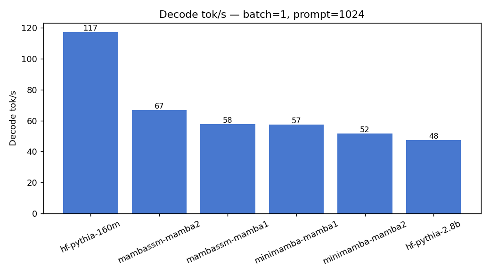
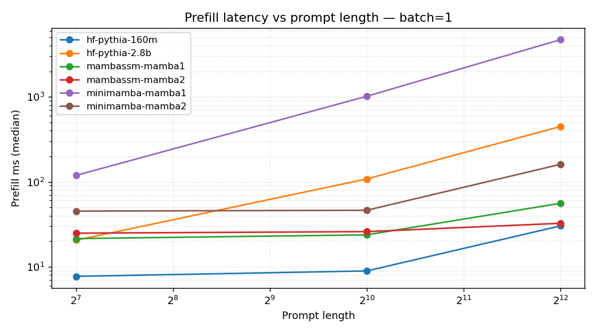
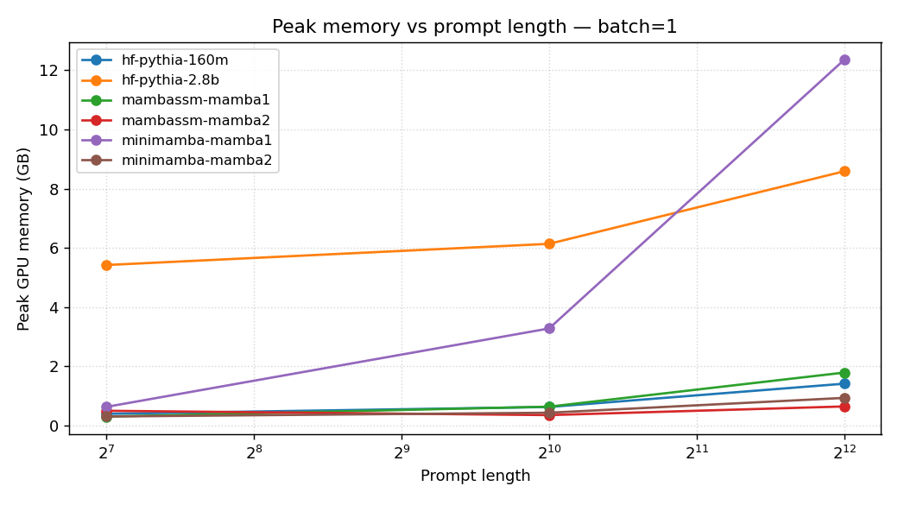

# Cross-engine benchmark suite

Hardware: **NVIDIA A10G (24 GB)**, dtype **fp16**, CUDA 12.1, PyTorch 2.4,
mamba_ssm 2.2.2.

## Harness — `benchmarks/suite.py`

Patterns mirror this repo's earlier microbenches (`decode_kernel.py`,
`parallel_scan.py`): CUDA-event timing, one warmup + median-of-N (default N=3),
per-config try/except for OOMs so the matrix doesn't die on one big
model. Runner registry dispatches across:

| Engine | Class | Params (M) |
|---|---|---:|
| `minimamba-mamba1` | our Mamba-1, parallel scan + optional Triton decode | 129.1 |
| `minimamba-mamba2` | our Mamba-2, SSD prefill + pure-PyTorch step | 129.1 |
| `mambassm-mamba1` | HF `transformers` `MambaForCausalLM` | 129.1 |
| `mambassm-mamba2` | `mamba_ssm.MambaLMHeadModel` (Triton fused) | 129.1 |
| `hf-pythia-160m` | dense transformer baseline | 162.3 |
| `hf-pythia-2.8b` | dense transformer ceiling | 2775.2 |

Metrics per config: `prefill_ms`, `ttft_ms` (prefill + first token),
`decode_ms_per_tok`, `decode_tok_s`, `peak_mb`, `params_m`,
`bytes_per_param`. Outputs at `benchmarks/results/suite_v1.{csv,json}`.

## Matrix

Batches **{1, 4}**, prompt lengths **{128, 1024, 4096}**, gen **128**.
36 configs, 35 ok, 1 OOM (our Mamba-1 at B=4 pl=4096 — parallel-scan
intermediates ≥ 24 GB).

## Results

### Decode tok/s at batch=1, prompt=1024



| Engine | Decode tok/s |
|---|---:|
| hf-pythia-160m | **117.4** |
| mambassm-mamba2 | 67.0 |
| mambassm-mamba1 | 57.9 |
| minimamba-mamba1 | 57.4 |
| minimamba-mamba2 | 51.6 |
| hf-pythia-2.8b | 47.5 |

Pythia-160m wins decode by a wide margin. At batch 1 everyone is
latency-bound — Pythia's tiny step (one attention + 2 MLP) beats
Mamba's step (in_proj + conv + SSM + gated-norm + out_proj) for the
same param class. Our Mamba-1 and Mamba-2 trail the `mamba_ssm`
Triton-fused decoder by ~10–20% — the gap is Python-level dispatch
overhead + un-fused norm/conv, **not** the SSM math. Confirmed in
decode-kernel microbench: replacing only the SSM step with Triton moves decode
tok/s by ~1%.

### Prefill latency vs prompt length — the "linear vs quadratic" plot



Prefill (ms), batch=1:

| Engine | pl=128 | pl=1024 | pl=4096 |
|---|---:|---:|---:|
| hf-pythia-160m | 7.7 | 8.9 | 30.3 |
| mambassm-mamba1 | 21.5 | 23.8 | 55.9 |
| mambassm-mamba2 | 24.9 | 25.9 | 32.5 |
| **minimamba-mamba2** | 45.3 | 46.3 | **161.0** |
| minimamba-mamba1 | 119.1 | 1016.7 | 4720.3 |
| hf-pythia-2.8b | 20.6 | 108.2 | 448.9 |

Two takeaways:

1. **SSD is flat through 1k.** Our Mamba-2 prefill goes 45 → 46 → 161 ms.
   The work is chunked GEMMs; up to ~1k it's one chunk of work + fixed
   overhead, and the scan never shows up as a bottleneck.
2. **Pythia-2.8b's quadratic tail is clearly visible.** 21 → 108 → 449 ms
   — ~4× per 4× in length. Our Mamba-2 at pl=4096 (161 ms) **beats
   Pythia-2.8b (449 ms) by 2.8×** even though our SSD is pure einsum,
   not Triton. This is the point of Mamba.

Our Mamba-1 line is slow (parallel Blelloch scan in pure PyTorch costs
8×–70× over the reference). We kept it as a parity artifact — the
Mamba-2 SSD path is the one we'd actually ship.

### Peak memory vs prompt length



Peak memory (MB), batch=1:

| Engine | pl=128 | pl=1024 | pl=4096 |
|---|---:|---:|---:|
| mambassm-mamba2 | 507 | 359 | 658 |
| minimamba-mamba2 | 311 | 440 | 954 |
| mambassm-mamba1 | 307 | 651 | 1830 |
| hf-pythia-160m | 403 | 639 | 1446 |
| hf-pythia-2.8b | 5551 | 6284 | 8795 |
| minimamba-mamba1 | 643 | 3356 | 12653 |

Mamba-2 stays under 1 GB even at 4k — SSD's state is $O(1)$ per head.
Pythia-2.8b sits at 5.6 GB just for weights and adds KV cache linearly.
Our Mamba-1 (parallel scan) is memory-expensive because the scan
materializes $(B, L, D, N)$ intermediates — at B=4 pl=4096 it OOMs the
24 GB A10G. That's a known property of a pure-PyTorch Blelloch scan
without `mamba_ssm`-style fused chunking.

## Analysis

### Where minimamba matches the reference, where it lags

- **Prefill, Mamba-2 vs mamba_ssm Triton.** At pl=128 we're 45 ms vs
  25 ms (1.8× slower). At pl=4096 it's 161 ms vs 33 ms (4.9×). The gap
  widens because our einsum prefill doesn't fuse the conv + dt_bias +
  softplus + chunk scan — each step is a separate kernel launch. Still
  **linear in L**, just with a larger constant.
- **Prefill, Mamba-1 vs HF.** HF uses `mamba_ssm`'s fused chunk kernel
  under the hood; ours is a pure-PyTorch Blelloch scan. Constant-factor
  gap of ~5× (bearable) at short prompts grows to ~85× at pl=4096
  because our scan allocates $(B, L, D, N)$ memory that fused kernels
  avoid. This is also why we OOM at B=4 pl=4096.
- **Decode, both arches.** We're within 10–20% of `mamba_ssm` — most of
  the gap is Python dispatch and un-fused RMSNorm/conv, not SSM math.

### Where Mamba beats Pythia

- **Prefill at long context.** At pl=4096 our Mamba-2 (161 ms) beats
  Pythia-2.8b (449 ms) — even though Pythia is 20× fewer "Mamba-weights"
  to move. The crossover on this hardware is around pl ≈ 1.5–2k for
  Mamba-2 vs Pythia-2.8b.
- **Memory scaling.** Pythia-2.8b at pl=4096 sits at 8.8 GB; our
  Mamba-2 is 0.95 GB. A production long-context workload on a 24 GB
  card fits Mamba comfortably; Pythia-2.8b at B=4 pl=4096 already needs
  ~19 GB.
- **Batch scaling at long context.** Mamba-2's per-step memory is
  dominated by O(1) SSM state × batch, so doubling batch adds ~hundreds
  of MB. Pythia's KV cache is O(batch × seqlen), so doubling batch at
  4k adds multi-GB.

### Where Pythia wins

- **Short-prompt everything.** Pythia-160m at pl=128 does prefill in
  7.7 ms; our best Mamba number is 22 ms. Attention's constants win
  below ~1k.
- **Decode tok/s at batch 1.** Pythia-160m 117 tok/s vs 50–67 across
  Mamba 130m's. Mamba's step has more work (four Linears + SSM + gated
  norm); attention at short KV is cheap.
- **Pythia-2.8b latency at short prompts** is still competitive — 20 ms
  prefill at pl=128 is only 2× our Mamba-2's 45 ms while being 20× the
  parameters.

### Triton decode kernel — honest MBU recap

From the decode-kernel microbench (`benchmarks/results/decode_kernel.gpu.json`):

- **2.3–2.7×** speedup over pure-PyTorch equivalent for the isolated
  SSM step.
- **MBU: 1.5% at B=1 → 12% at B=8** of the A10G's 600 GB/s peak.
- Launch-latency bound (~60 µs floor) at Mamba-130m shapes.
- End-to-end decode tok/s does **not** move with `--use-triton` — the
  SSM math isn't where decode time is spent at this scale.

### Known caveats

1. Our fp16 conv1d and RMSNorm are un-fused pure-PyTorch; `mamba_ssm`
   fuses these. Accounts for most of our decode gap vs the reference.
2. No CUDA graphs on our side. Every decode step pays Python overhead.
3. HF `transformers` `MambaForCausalLM` has its own generate() overhead
   that inflates its tok/s numbers vs an isolated step.
4. `minimamba-mamba1` at B=4 pl=4096 **OOM** — our pure-PyTorch Blelloch
   scan materializes O(B·L·D·N) intermediates. Fused chunk scan (like
   mamba_ssm's) fixes this, but we didn't port it.

## Reproduce

```bash
# ~15 min on A10G, fp16
PYTHONPATH=. python benchmarks/suite.py \
  --dtype float16 \
  --engines minimamba-mamba1-130m minimamba-mamba2-130m \
            mambassm-mamba1-130m mambassm-mamba2-130m \
            pythia-160m pythia-2.8b \
  --batches 1 4 --prompt-lens 128 1024 4096 --gen-lens 128 \
  --iters 3 --warmups 1 --tag suite_v1

PYTHONPATH=. python benchmarks/plot_suite.py \
  --csv benchmarks/results/suite_v1.csv
```

Opt-in bigger sweeps:

```bash
--batches 1 4 16                                 # B=16 OOMs most dense at 4k
--prompt-lens 128 1024 4096 16384 32768          # only Mamba survives past 4k
```
